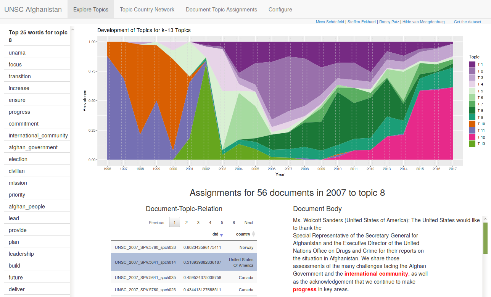

# tminspector

The tminspector is a shiny app used to inspect topic models. It combines information about the model with access to the underlying documents.

## Usage

Given a ``URL`` to a tminspector dataset, use the following snippet to start the tminspector:

```
library(shiny)
TMINSPCT_SOURCE_URL <- URL
runGitHub("tminspector","TwlyY29")
```

## Requirements

Use the following snippet to install required packages:

```
install.packages("shiny","ggplot2","plotly","stm","DT","RCurl","XML","igraph","visNetwork","stringr","text2vec","utils","servr", dependencies=T)
```

## In Action


